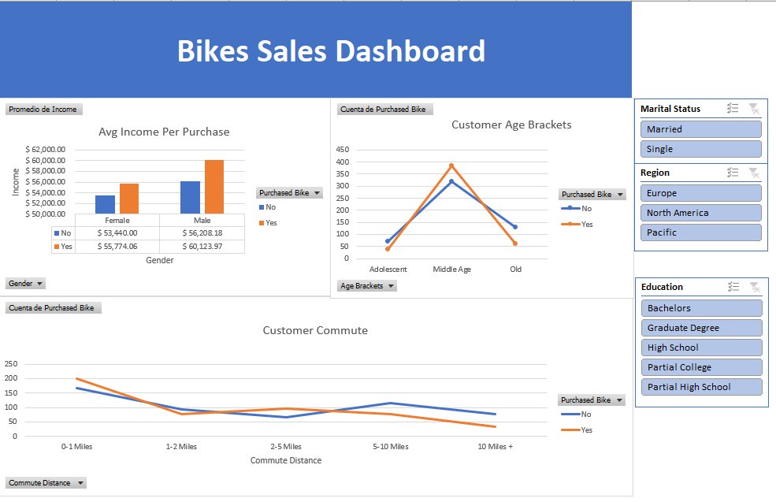

# Data Analyst Portfolio: Bike Sales Dashboard

## Overview

Welcome to my Data Analyst portfolio! This repository showcases my proficiency in data analysis and visualization, demonstrating the technical skills that make me a strong candidate for an entry-level Data Analyst position.

In this project, I created a Bike Sales Dashboard using Microsoft Excel. The dashboard offers insights into fictional bike sales data and allows for data exploration and filtering.

## Project Highlights

- **Data Visualization**: I utilized Excel's powerful charting capabilities to visualize sales data, making it easy to identify trends and patterns.

- **Data Filtering**: The dashboard includes interactive filters that enable users to customize their data analysis by criteria such as date, product category, or region.

- **Data Insights**: I designed the dashboard to provide clear and actionable insights, aiding in decision-making processes for business stakeholders.

## Technical Skills Demonstrated

- **Data Analysis**: This project demonstrates my ability to analyze data, extract meaningful insights, and present them in a clear and visually appealing manner.

- **Data Visualization**: I leveraged Excel's charting features to create informative visual representations of the data.

- **Data Manipulation**: I used Excel functions to clean and transform raw data into a structured format suitable for analysis.

- **Technical Proficiency**: Proficiency in Excel, including Pivot Tables, VLOOKUP, and chart creation, showcases my technical skills as a Data Analyst.
